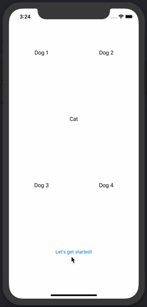

# BalloonView
Makes balloon-like view with an arrow pointing to another view. Useful for onboarding tutorials

Just copy `BalloonView.swift` into your project and it's ready to use!



## Example
```swift
let balloonView = BalloonView(contentView: contentView, forView: button, withinSuperview: view)
balloonView.show(onTapped: { $0.dismiss(); return nil })
```

## Multiple BalloonView transition example
```swift
let balloonViewOne = BalloonView(contentView: contentView, forView: button, withinSuperview: view)
let transitions = tutorialBalloon.onTapped({ balloonViewOne in
    balloonViewOne?.dismiss()
    return BalloonView(contentView: contentViewTwo, forView: buttonTwo, withinSuperview: view)
}) >>> { balloonViewTwo in
    balloonViewTwo?.dismiss()
    return BalloonView(contentView: contentViewThree, forView: buttonThree, withinSuperview: view)
} >>> { balloonViewThree in
    balloonViewThree?.dismiss()
    return nil
}
balloonViewOne.show(onTapped: transitions)
```

## Contribution

Please read the CLA below carefully before submitting your contribution.

https://www.mercari.com/cla/

## License

Copyright 2018 Mercari, Inc.

Licensed under the MIT License.
